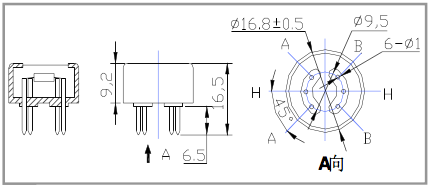
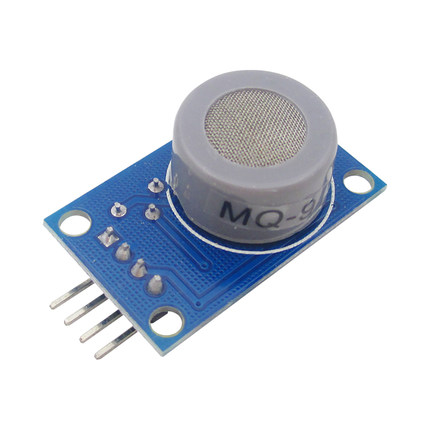
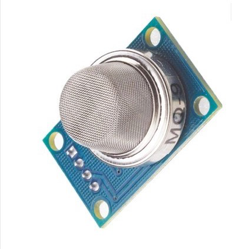
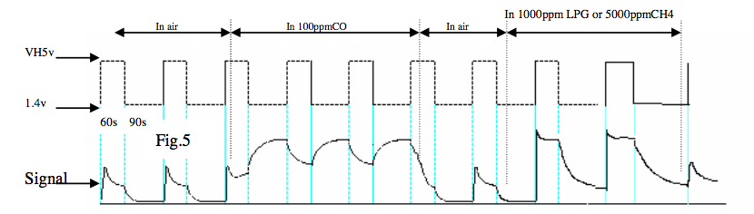

# MQ-9 interface

The MQ-9 is a Carbon Monoxide and combustible gas sensor made by [Henan Hanwei Electronics Co.,Ltd.](http://www.hwsensor.com).
Hanwei makes a number of related sensors (MQ-1, MQ-2, ...) that have a similar mode of operation but detect other types of gasses.

The MQ-9 is available from a number of Chinese suppliers and appear to be available in multiple package styles which all appear to function equally. They typically measure about 17mm in diameter and 8-12mm high (from base to top of the sensor). Below is an image showing the pinout from one of the datasheets:

The sensor consists of a heating coil (H pins) and the sensor (between pins A and B). One of the sensor pins is connected a load resistor R~L~, the recommended value in the datasheet is from 10k to 47k. Specific to the MQ-9, it is recommendad that the the heating coil voltage V~H~ alternate between 5V (combustible gas readings) for 60s and 1.4-1.5V (CO readings) for 90s. The 5V cycle is important to "clear" the sensor -- once CO or a combustible gas is detected, it binds to the sensor. The sensor needs to be heated to remove contaminants. The datasheet recommends "pre-heating" the sensor for 48 hours before use, i.e., aging the sensor under 5V V~H~ before use. No guidance is given specifically on the sensor voltage V~S~.

There exist breakout boards as shown below which integrate a variable load resistor (to adjust sensitivity), a voltage comparator to convert the analog input to digital (alarm/noalarm states), and LEDs to display an "alarm state". The breakout boards are inconvenient for the MQ-9, as they assume V~H~ and V~S~ are equal. The voltage comparator settings are not usable in both the combustible gas and CO detection schemes without adjustment.

The following sensor output graph was provided in one of the datasheets. In the included examples, we assume that a constant voltage is used for sensor voltage V~S~. V~S~ = 3.3V was chosen for a convenient reference against V~CC~ for the MSP430.

